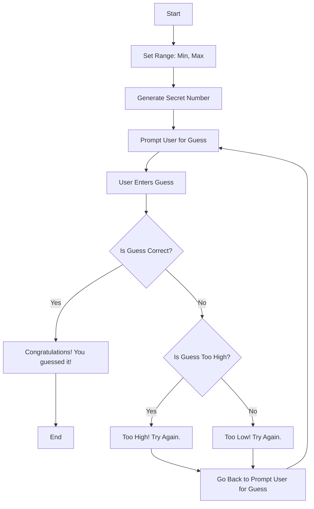

## **Flowchart Description**
#### Start: *User Starts Game.*
#### Set Range: Min, Max: *Game Generates A Number With A Minimum And A Maximum So The Player Knows The Range To Guess In.*
#### Generate Secret Number: *Game generates a number.*
#### Prompt User for Guess: *The game then prompts the player to guess a number.*
#### User Enters Guess: *The player then enters a number that they think is the right one.*
#### Is Guess Correct?: *This now determines if the guess was correct or incorrect.*
#### If Yes: Congratulations! You guessed it!: *If the player guesses the answer correctly, then a message will be displayed to inform the player that they are correct.*
  ###### End if correct
#### If No: Is Guess Too High?: *If the answer is no, then the game will determine if it was too high or too low and display the following message based on the decision:*
#### *Too High! Try Again.*
#### *Too Low! Try Again.*
#### Go Back to Prompt User For Guess: *After displaying the too high or too low message, the game will then redirect the player back to the prompt screen that asks the player for a guess.*
